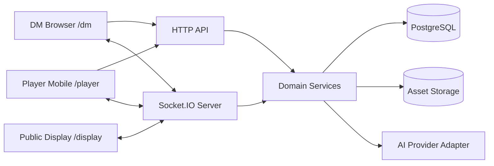
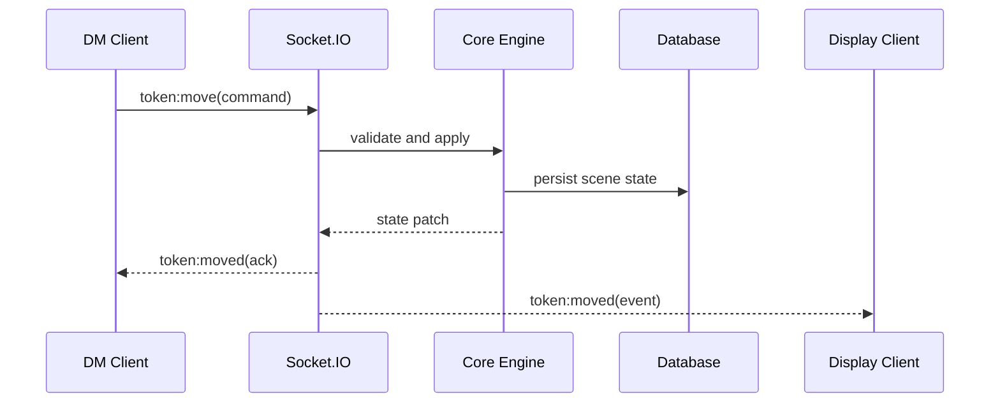
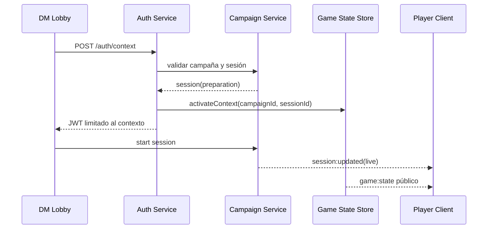

# Arquitectura del Sistema

## Objetivo arquitectónico

Construir un motor modular de campañas de rol, con una primera experiencia centrada en mesa digital para D&D y una base extensible a otros sistemas. La arquitectura debe separar presentación, sincronización, dominio, persistencia, reglas e IA.

## Stack inicial

- Frontend: React, Vite, TypeScript, React Router, Zustand, TanStack Query, Axios, React-Konva, Framer Motion, Tailwind.
- Backend: Node.js, Express, Socket.IO, Prisma, PostgreSQL, Zod, JWT y bcrypt.
- Compartido: tipos TypeScript en `shared/`.
- Documentación: Markdown, Mermaid y OpenAPI.

## Vista C4 de contenedores



## Capas

### Client

Responsable de experiencia visual e interacción:

- Rutas por rol: `/dm`, `/display`, `/player`.
- Estado local de UI con Zustand.
- Datos remotos y caché con TanStack Query.
- Render de mapas con React-Konva.
- Animaciones de experiencia con Framer Motion.
- Cliente Socket.IO para eventos en tiempo real.

### Server

Responsable de autoridad, validación y coordinación:

- Express para API HTTP.
- Socket.IO para sincronización.
- Middleware de identidad, campaña y rol compartido por HTTP y realtime.
- Servicios de dominio por motor.
- Validación de entrada.
- Persistencia con Prisma o snapshots JSON atómicos en modo local.
- Adaptadores externos para IA y assets.

### Shared

Contratos compartidos:

- Tipos de dominio usados por frontend y backend.
- Payloads de eventos.
- Enumeraciones de reglas comunes.
- Tipos versionados cuando el contrato sea público.

### Database

Fuente de persistencia:

- Campañas, mundos, sesiones, escenas y mapas.
- Personajes, NPCs, enemigos, tokens y encuentros.
- Tiradas, logs de IA y auditoría.
- Assets y metadatos.

## Límites de módulo

| Módulo | Responsabilidad | No debe hacer |
| --- | --- | --- |
| Core Engine | Orquestar estado de juego y escenas | Renderizar UI o llamar directamente a IA |
| Map Engine | Mapas, capas, tokens, grid y medición | Resolver reglas de combate |
| Combat Engine | Turnos, iniciativa, daño y condiciones | Controlar cámara o audio |
| Dice Engine | Parseo y ejecución de tiradas | Persistir campañas completas |
| NPC Engine | NPCs, enemigos, perfiles y vínculos | Decidir sincronización de red |
| Campaign Engine | Mundos, campañas, sesiones y lore | Renderizar mapas |
| AI Engine | Generación asistiva y auditoría | Guardar cambios sin aprobación |
| Networking | Rooms, eventos y snapshots | Contener reglas de juego |
| Audio/Lighting/Effects | Ambiente, iluminación y animaciones | Ser fuente de verdad de dominio |

## Flujo de estado



## Decisiones base

- El servidor es autoridad para cambios de estado compartido.
- El display nunca recibe secretos del DM.
- Los eventos en tiempo real transportan comandos y patches, no lógica de reglas.
- El motor de reglas debe ser extensible por sistema.
- La IA funciona como asistente revisable.
- Los documentos de diseño son parte del contrato del proyecto.

## Session Workflow

`SessionWorkflowService` coordina el ciclo de vida sin absorber las reglas del
tablero. `CampaignService` mantiene el catálogo y las fases persistentes;
`GameStateStore` activa una escena por contexto y conserva el historial; la
capa de seguridad reemite el token DM para la campaña y sesión elegidas.



Solo una sesión puede estar `live` por instancia. Preparación permite editar al
DM sin exponer la escena; `live` abre la sincronización; `ended` conserva estado
y resumen. La presencia es efímera, mientras catálogo, personajes y snapshots
son durables.

## Estructura propuesta de backend

```text
server/src/
  app.ts
  index.ts
  socket.ts
  config/
  routes/
  modules/
    campaigns/
    maps/
    combat/
    dice/
    npcs/
    ai/
  realtime/
  persistence/
  validation/
```

## Estructura propuesta de frontend

```text
client/src/
  app/
  routes/
    dm/
    display/
    player/
  features/
    map/
    combat/
    dice/
    campaign/
    ai/
  shared/
    api/
    socket/
    ui/
    state/
```

## Quality gates

Antes de cerrar una feature:

- Tipos compartidos actualizados.
- Documento de módulo actualizado.
- Contrato HTTP o Socket.IO documentado.
- Pruebas mínimas agregadas.
- El display no recibe campos privados.
- El build del cliente y servidor pasa.
