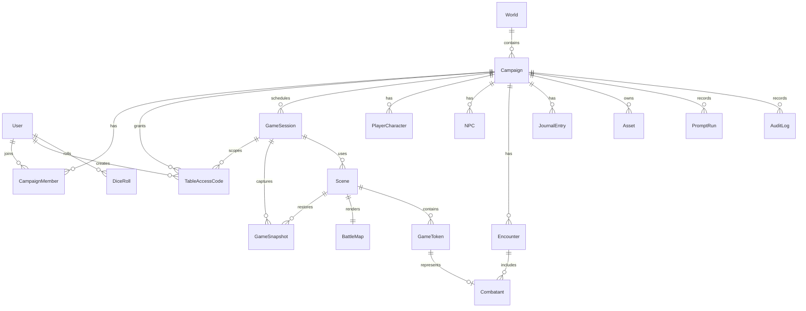

# Diseño de Base de Datos

## Objetivo

Definir un modelo relacional inicial para campañas, mundos, escenas, mapas, tokens, personajes, NPCs, encuentros, tiradas, assets e IA. La implementación objetivo será PostgreSQL con Prisma.

## Convenciones

- IDs: `uuid`.
- Timestamps: `createdAt`, `updatedAt`.
- Borrado lógico solo donde sea útil para campañas y contenido creativo.
- Campos flexibles por sistema de reglas: `rulesData Json`.
- Campos secretos separados o marcados con visibilidad.
- Relaciones críticas con integridad referencial.

## ERD inicial

## Entidades principales

### User

Representa una identidad local o autenticada.

- `id`
- `displayName`
- `email`
- `passwordHash`: bcrypt; opcional para identidades heredadas o invitadas
- `role`
- `createdAt`
- `updatedAt`

### World

Contenedor reusable de lore.

- `id`
- `name`
- `description`
- `systemTags`
- `createdAt`
- `updatedAt`

### Campaign

Campaña jugable.

- `id`
- `worldId`
- `name`
- `description`
- `ruleset`
- `status`
- `settings Json`
- `createdAt`
- `updatedAt`

### CampaignMember

Permisos por campaña.

- `id`
- `campaignId`
- `userId`
- `role`: `dm`, `player`, `viewer`
- `permissions Json`

### GameSession

Sesión de juego.

- `id`
- `campaignId`
- `title`
- `phase`: `PREPARATION`, `LIVE`, `ENDED`
- `scheduledAt`
- `startedAt`
- `endedAt`
- `summaryPublic`
- `summaryPrivate`

### TableAccessCode

Concesión temporal para clientes sin cuenta.

- `id`
- `campaignId`
- `sessionId`
- `createdById`
- `codeHash`: HMAC SHA-256; nunca el código visible
- `playerEnabled`
- `displayEnabled`
- `expiresAt`
- `revokedAt`
- `sessionsRevokedAt`: invalida tokens ya emitidos al cerrar la mesa
- `createdAt`
- `updatedAt`

### Scene

Escena jugable.

- `id`
- `sessionId`
- `campaignId`
- `battleMapId`
- `name`
- `narrativeText`
- `dmNotes`
- `isActive`
- `visibility`
- `sceneState Json`

### BattleMap

Mapa base.

- `id`
- `campaignId`
- `assetId`
- `name`
- `imageUrl`
- `gridSize`
- `width`
- `height`
- `scale`
- `metadata Json`

### GameToken

Representación visual en escena.

- `id`
- `sceneId`
- `entityType`: `player`, `enemy`, `npc`, `object`
- `entityId`
- `name`
- `x`
- `y`
- `size`
- `rotation`
- `color`
- `imageAssetId`
- `visible`
- `locked`
- `state Json`

### PlayerCharacter

Personaje jugador.

- `id`
- `campaignId`
- `ownerUserId`
- `playerKey`: identidad firmada del participante sin cuenta
- `name`
- `ancestry`
- `className`
- `level`
- `maxHp`
- `currentHp`
- `temporaryHp`
- `armorClass`
- `notes`
- `resources Json`
- `rulesData Json`

### GameSnapshot

Punto de restauración nombrado de una escena completa.

- `id`
- `campaignId`
- `sessionId`
- `sceneId`
- `createdById`
- `name`
- `payload Json`: `SceneSnapshot` versionado por contrato de aplicación
- `createdAt`

### NPC

Personaje no jugador narrativo.

- `id`
- `campaignId`
- `name`
- `role`
- `motivation`
- `voice`
- `publicNotes`
- `privateNotes`
- `secrets Json`
- `rulesData Json`

### Enemy

Criatura con estadísticas de combate.

- `id`
- `campaignId`
- `name`
- `creatureType`
- `maxHp`
- `currentHp`
- `armorClass`
- `challengeRating`
- `rulesData Json`

### Encounter

Encuentro de combate o reto estructurado.

- `id`
- `campaignId`
- `sceneId`
- `name`
- `status`
- `roundNumber`
- `activeCombatantId`
- `rulesData Json`

### Combatant

Participante de encuentro.

- `id`
- `encounterId`
- `tokenId`
- `entityType`
- `entityId`
- `initiative`
- `turnOrder`
- `conditions Json`
- `currentHp`
- `temporaryHp`

### DiceRoll

Tirada auditable.

- `id`
- `campaignId`
- `sessionId`
- `userId`
- `formula`
- `resultTotal`
- `breakdown Json`
- `visibility`
- `purpose`

### Asset

Archivo o recurso.

- `id`
- `campaignId`
- `type`: `map`, `token`, `portrait`, `music`, `sound`, `effect`
- `name`
- `url`
- `metadata Json`

### PromptRun

Registro de generación con IA.

- `id`
- `campaignId`
- `userId`
- `provider`
- `model`
- `purpose`
- `inputSummary`
- `outputSummary`
- `approved`
- `metadata Json`

### AuditLog

Registro de acciones relevantes.

- `id`
- `campaignId`
- `userId`
- `action`
- `entityType`
- `entityId`
- `before Json`
- `after Json`

## Índices iniciales

- `CampaignMember(campaignId, userId)`
- `Scene(campaignId, isActive)`
- `PlayerCharacter(campaignId, playerKey)` único cuando existe `playerKey`
- `GameSnapshot(campaignId, sessionId, createdAt)`
- `GameToken(sceneId)`
- `Encounter(sceneId, status)`
- `DiceRoll(campaignId, sessionId, createdAt)`
- `PromptRun(campaignId, createdAt)`
- `AuditLog(campaignId, createdAt)`

La migración `20260711143000_runtime_invariants` añade dos índices parciales que
Prisma no puede expresar en el schema: una sola `Scene.isActive=true` por
campaña y una sola `GameSession.phase=LIVE` por campaña. Si existen duplicados,
el deploy falla y exige corregir los datos en lugar de elegir un registro de
forma silenciosa.

## Decisiones pendientes

- Storage local vs S3-compatible.
- Separación de `NPC` y `Enemy` o unificación futura como `Actor`.
- Normalización de reglas por sistema frente a `rulesData Json`.

## Implementación actual

La implementación vive en `prisma/schema.prisma` y usa PostgreSQL como destino formal. Session Workflow se incorpora en `prisma/migrations/20260710183000_session_workflow/migration.sql`; las invariantes runtime se aplican en `prisma/migrations/20260711143000_runtime_invariants/migration.sql`.

El backend usa una capa de repositorio:

- Sin `DATABASE_URL`: catálogos, personajes y snapshots JSON con escritura atómica.
- Con `DATABASE_URL`: repositorio Prisma con adapter PostgreSQL.

Esta decisión permite seguir desarrollando el flujo realtime sin bloquear el proyecto por infraestructura local, mientras el contrato relacional ya queda definido.
