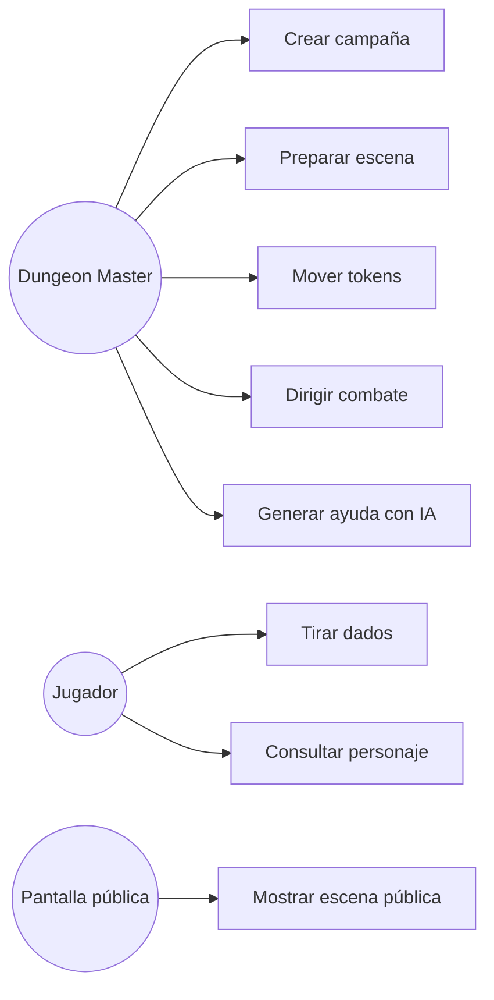
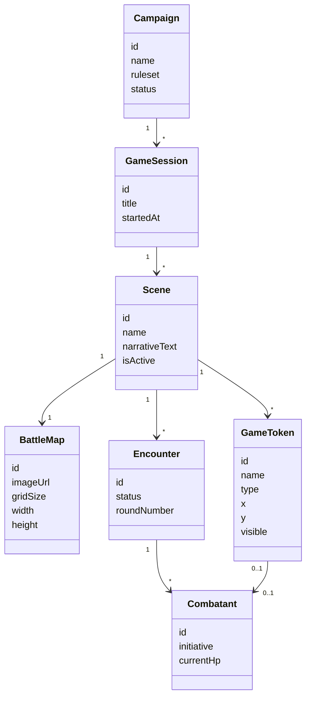
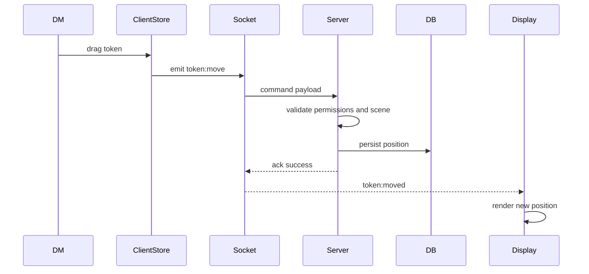
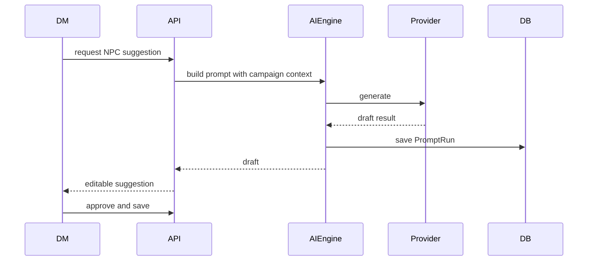
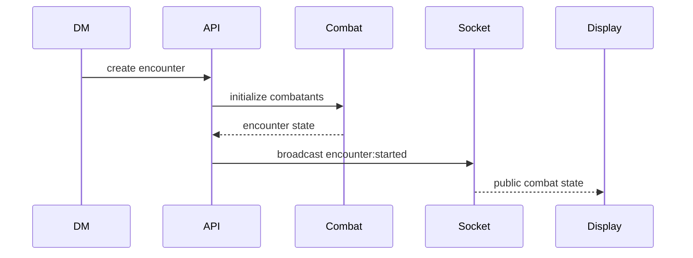

# Diagramas UML y Secuencias

Estos diagramas son base inicial. Deben actualizarse cuando cambien contratos o modelos.

## Casos de uso

## Clases de dominio iniciales

## Secuencia: mover token

## Secuencia: generar NPC con IA

## Secuencia: iniciar combate

